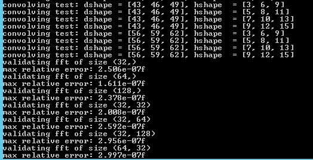

# Napari to process Zeiss lattice data

You will need Anaconda Navigator or Miniconda installed.
Install git into your conda environment and then clone the repo. 
Alternatively, you can just download it and open a terminal within the directory

The conda environment required for running the llsz package can be installed using the environment.yml file. 

To enable fast configuration of conda environments, it is recommended to install [mamba](https://github.com/mamba-org/mamba) into your base environment.

    conda install mamba -n base -c conda-forge

If you are having trouble with Anaconda, use Miniconda instead. 

Once this is installed, you can create a conda environment by replacing "conda" with "mamba"

Create the conda environment using .yml file

    conda env create -f environment.yml
 
If you have **mamba** use,

    mamba env create -f environment.yml

The above may take a while as a few files need to be downloaded.

Due to potential configuration issues with gputools and pyopencl, they are to be installed separately.

Try installing gputools first:

    pip install gputools

If it works, luck you!. pypopencl should have been installed and you can start using the environment. 

****
**If gputools installation does not work** -> You will get an error when building wheels for pyopencl. This means you will have to manually install pyopencl. To do this, use [pre-built wheels](https://www.lfd.uci.edu/~gohlke/pythonlibs/#pyopencl) here.

For Python 3.9 use files with cp39 in their name. Download a file with name [cl21](https://download.lfd.uci.edu/pythonlibs/y2rycu7g/pyopencl-2021.2.8+cl21-cp39-cp39-win_amd64.whl) , if that doesn't work, then try [cl12](https://download.lfd.uci.edu/pythonlibs/y2rycu7g/pyopencl-2021.2.8+cl12-cp39-cp39-win_amd64.whl). Download the file and then run 

    pip install pyopencl_file_name

Once you have successfully configured pyopencl, you can then install gputools.

    pip install gputools

To test if everything is working, run

    python -m gputools

If everything is working, you will see something like this:

If not, it could be that you installed the wrong pyopencl version. If you installed cl21, then download and install pyopenl with cl12 in the name.

*****
## **Running llsz**

Once the environment is configured, you can open a terminal within the package folder and run:

    python main.py

This will start a napari instance.
The worfklow currently is:
* Open a czi file (skewed raw data)
* Deskew a single timepoint
* Use the deskewed stack and max projection for previewing and cropping an area of interest

