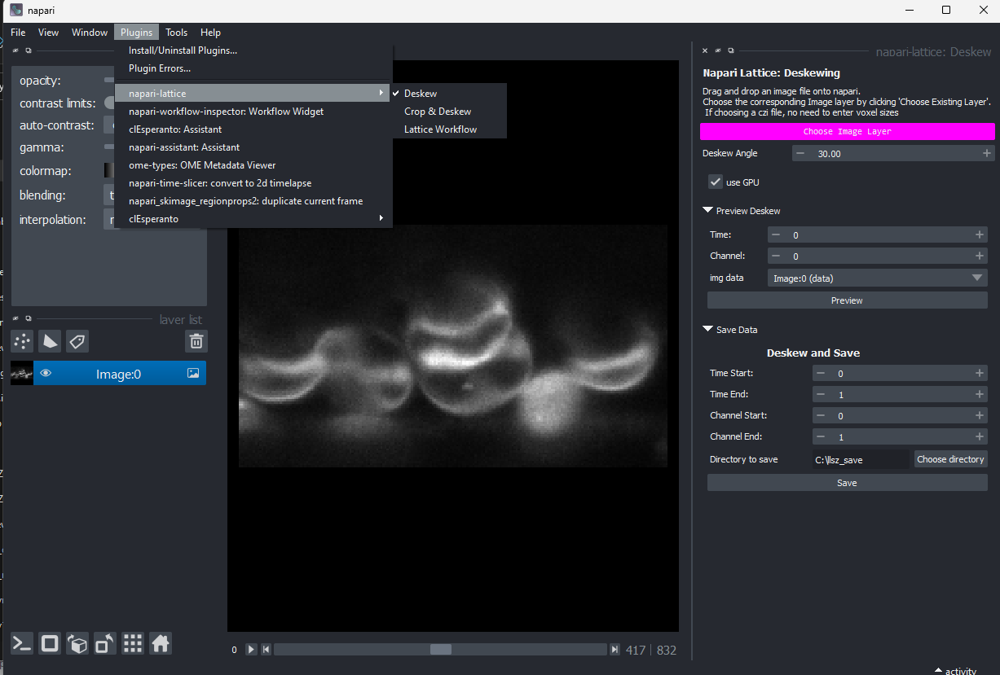

# **Napari-Lattice-Lightsheet**

----------------------------------

This [napari] plugin was generated with [Cookiecutter] using with [@napari]'s [cookiecutter-napari-plugin] template.

<!--
Don't miss the full getting started guide to set up your new package:
https://github.com/napari/cookiecutter-napari-plugin#getting-started

and review the napari docs for plugin developers:
https://napari.org/docs/plugins/index.html
-->

This napari plugin allows deskewing, cropping and visualisation of lattice lightsheet data from a Zeiss lattice lightsheet microscope. Support will eventually be for other oblique plane lightsheet microscopy files.

## **Installation**

Use a conda environment for installation. You will need [Anaconda Navigator](https://www.anaconda.com/products/individual) or a lighter version [Miniconda](https://docs.conda.io/en/latest/miniconda.html) installed. Click on the Anaconda prompt or terminal and create an environment first:

    conda create -n llsz python=3.9

You can use any name instead of "llsz". Once an environment is created, activate it by typing with the name you used:

    conda activate llsz

Start with installing [pyopencl](https://documen.tician.de/pyopencl/)

    conda install -c conda-forge pyopencl

If you have trouble installing pyopencl on Windows, use a precompiled wheel from [here](https://www.lfd.uci.edu/~gohlke/pythonlibs/#pyopencl). As we use python 3.9, you have to download and try the wheels which have cp39 in their name. For example, if we download `pyopencl‑2022.1‑cp39‑cp39‑win_amd64.whl`, then we navigate to the download folder and run:

    pip install pyopencl‑2022.1‑cp39‑cp39‑win_amd64.whl

If this version doesn't work, try `pyopencl‑2021.2.9+cl12‑cp39‑cp39‑win_amd64.whl`

*************

To install latest version of the napari plugin:

    pip install git+https://github.com/pr4deepr/llsz_napari.git

*************
## **Features**

All transformations are now powered by clesperanto.

Functions:
* Opening files (2 options)
  * Open a czi lattice file OR 
  * Select an existing image layer in napari. This means you will have to enter voxel sizes and deskewing angle manually
* Preview deskewing on any time or channel
* Preview cropping on any time or channel
* Save deskewed stack for time and channel range of interest
* Save cropped stack for time and channel range of interest

*****
## **Usage**

Once installed, just [start napari](https://napari.org/tutorials/fundamentals/getting_started.html#command-line-usage) and the plugin should be under "Plugins" tab

### ****File compatibility**

You can directly open a Zeiss lattice file by clicking `open a czi file`. Alternatively, drag and drop an image stack in napari and then click `Choose Existing Layer` to set the values for this image layer. 

### **Previewing data**

To preview the deskewed output of a single timepoint and channel, choose the layer under the box `img data` and click  `Preview`

### **Previewing cropped data**

Click Initialise shapes layer so you can draw an ROI for the region you would like to crop. The first ROI in the Shapes layer selected in `roi layer` will be deskewed. 

Note: The cropping functionality works by calculating the corresponding coordinates in the raw data and then deskewing only that portion. This should save time if you decide to use `Crop and Save Data` option.

### **Save Data**

Use this option if you would like to deskew and save a range of timepoints and channels. The output will be printed to the console and the GUI maybe unresponsive till the output is saved. This unresponsiveness will be fixed soon.

### **Crop and Save Data**
Use this option if you would like to deskew and save only the ROIs you've defined in the Shapes layer. If you've selected multiple regions, it deskew and save all of them in order.

*******

Please find sample data for testing in the `sample_data` folder above

***Data Credit: Cindy Evelyn & Niall Geoghegan, Walter and Eliza Hall Institute of Medical Research, Melbourne, Australia***

To do:
* Clean up UI (Menu options?)
* Implement image analysis workflow option
* Include deconvolution
* Add batch processing option (no napari -> magic-class or magicgui only)

## Contributing

Contributions are very welcome. Tests can be run with [tox], please ensure
the coverage at least stays the same before you submit a pull request.

## License

Distributed under the terms of the [BSD-3] license,
"llsz_napari" is free and open source software

## Issues

If you encounter any problems, please [file an issue] along with a detailed description.

[napari]: https://github.com/napari/napari
[Cookiecutter]: https://github.com/audreyr/cookiecutter
[@napari]: https://github.com/napari
[MIT]: http://opensource.org/licenses/MIT
[BSD-3]: http://opensource.org/licenses/BSD-3-Clause
[GNU GPL v3.0]: http://www.gnu.org/licenses/gpl-3.0.txt
[GNU LGPL v3.0]: http://www.gnu.org/licenses/lgpl-3.0.txt
[Apache Software License 2.0]: http://www.apache.org/licenses/LICENSE-2.0
[Mozilla Public License 2.0]: https://www.mozilla.org/media/MPL/2.0/index.txt
[cookiecutter-napari-plugin]: https://github.com/napari/cookiecutter-napari-plugin

[file an issue]: https://github.com/pr4deepr/llsz_napari/issues

[napari]: https://github.com/napari/napari
[tox]: https://tox.readthedocs.io/en/latest/
[pip]: https://pypi.org/project/pip/
[PyPI]: https://pypi.org/
