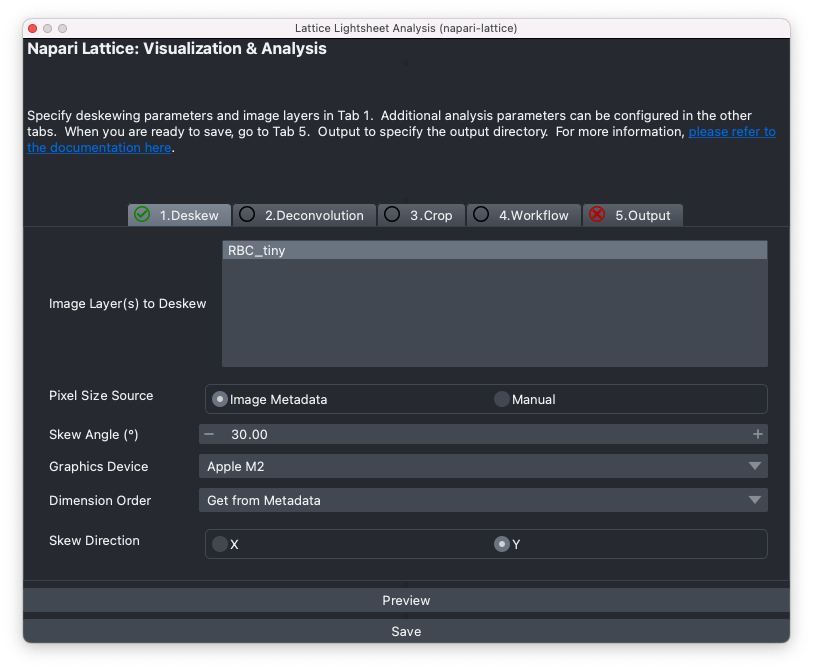

# napari-lattice

This napari plugin allows deskewing, cropping, visualisation and designing custom analysis pipelines for lattice lightsheet data, particularly from the Zeiss Lattice Lightsheet. It also has a command line mode (CLI), lls-core, so you can run it without the GUI.

## **Documentation**

Check the [Docs website](https://bioimageanalysiscorewehi.github.io/napari_lattice/) for documentation on how to get started.

*************

**Functions**

* Deskewing and deconvolution of Lattice Lightsheet data with a focus on the Zeiss LLS7
* Ability to preview deskewed image at channel or timepoint of interest
* Crop and process only a small portion of the image 
* Import ImageJ ROIs for cropping
* Create image processing workflows using napari-workflows
* Run deskewing, deconvolution and custom image processing workflows from the terminal
* Files can be saved as ome zarr, h5 (BigDataViewer/BigStitcher) or tiff files
* COmmand Line Interface (CLI) `lls-core` to run napari-lattice workflows on the HPC at scale

**Key Features**

Apply custom image processing workflows using `napari-workflows`. 

Support will be added for more file formats in the future.

Sample lattice lightsheet data download: <https://doi.org/10.5281/zenodo.7117784>

## Citing

Rajasekhar, P., Milton, M., Geoghegan, N., Haase, R., Rogers, K. L., & Whitehead, L. (2025). napari-lattice (v1.0.3). Zenodo. https://doi.org/10.5281/zenodo.14974337

## Contributing

Contributions are very welcome. Please refer to the [Development](./development.md) docs to get started.

## License

Distributed under the terms of the [GPL-3.0 License] license,
"napari_lattice" is free and open source software

## Acknowledgment

 This project was supported by funding from the [Rogers Lab at the Centre for Dynamic Imaging at the Walter and Eliza Hall Institute of Medical Research](https://imaging.wehi.edu.au/). This project has been made possible in part by [Napari plugin accelerator grant](https://chanzuckerberg.com/science/programs-resources/imaging/napari/lattice-light-sheet-data-analysis-toolset/) from the Chan Zuckerberg Initiative DAF, an advised fund of the Silicon Valley Community Foundation.

 Thanks to the developers and maintainers of the amazing open-source plugins such as [pyclesperanto](https://github.com/clEsperanto/pyclesperanto_prototype), [aicsimageio](https://github.com/AllenCellModeling/aicsimageio), [dask](https://github.com/dask/dask) and [pycudadecon](https://github.com/tlambert03/pycudadecon).
 Thanks in particular to the developers of open source projects: [LLSpy](https://github.com/tlambert03/LLSpy) and [lls_dd](https://github.com/VolkerH/Lattice_Lightsheet_Deskew_Deconv) as they were referred to extensively for developing napari-lattice.
 Thanks to the imagesc forum!

## Issues

If you encounter any problems, please [file an issue](https://github.com/BioimageAnalysisCoreWEHI/napari_lattice/issues) along with a detailed description.

[napari]: https://github.com/napari/napari
[Cookiecutter]: https://github.com/audreyr/cookiecutter
[@napari]: https://github.com/napari
[MIT]: http://opensource.org/licenses/MIT
[BSD-3]: http://opensource.org/licenses/BSD-3-Clause
[GGPL-3.0 License]: http://www.gnu.org/licenses/gpl-3.0.txt
[GNU LGPL v3.0]: http://www.gnu.org/licenses/lgpl-3.0.txt
[Apache Software License 2.0]: http://www.apache.org/licenses/LICENSE-2.0
[Mozilla Public License 2.0]: https://www.mozilla.org/media/MPL/2.0/index.txt
[cookiecutter-napari-plugin]: https://github.com/napari/cookiecutter-napari-plugin

[napari]: https://github.com/napari/napari
[tox]: https://tox.readthedocs.io/en/latest/
[pip]: https://pypi.org/project/pip/
[PyPI]: https://pypi.org/
