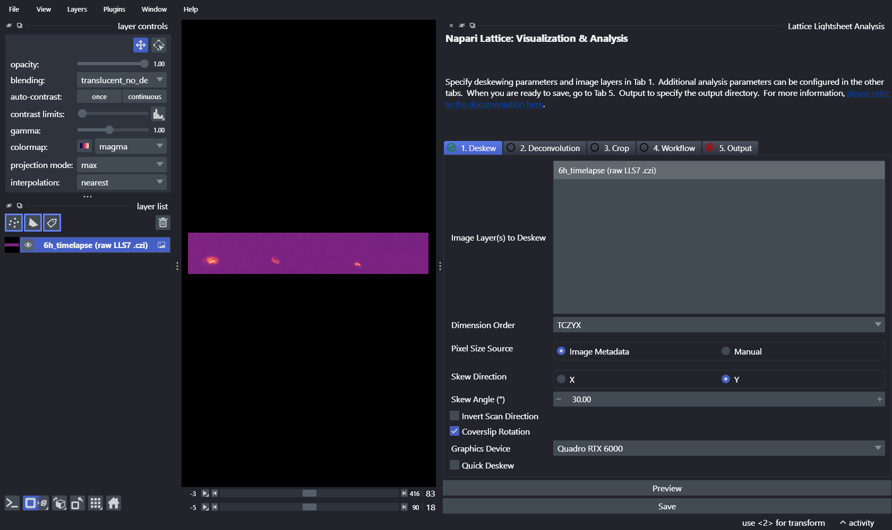
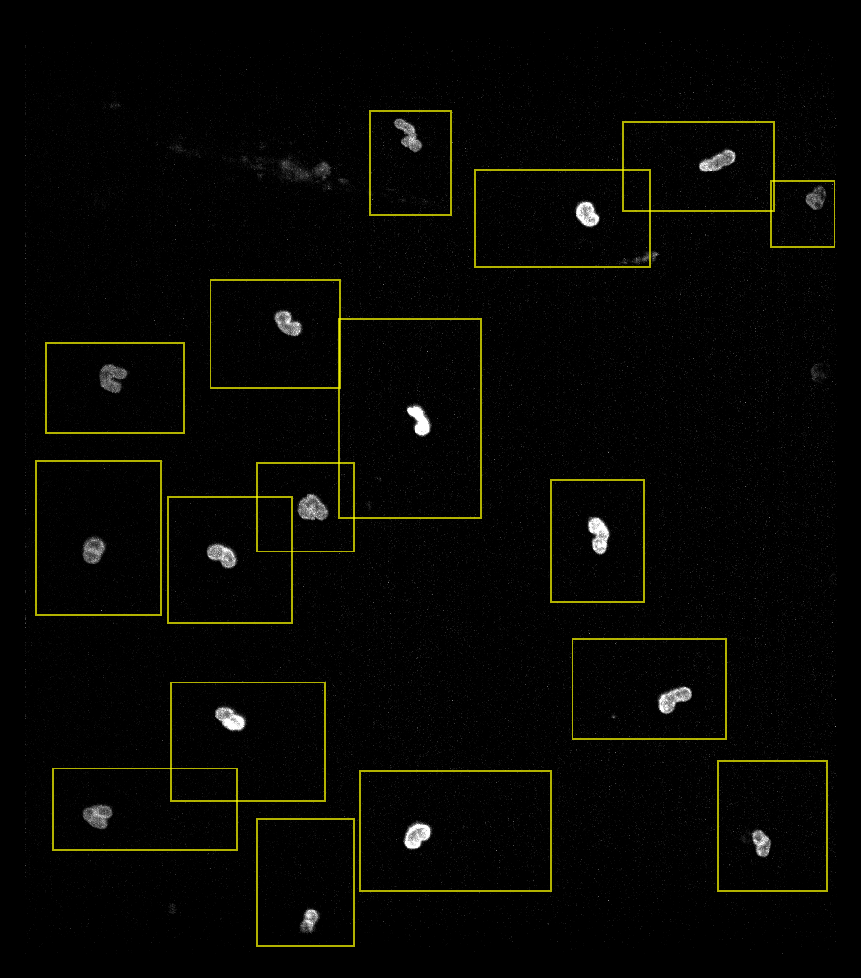

# Neutrophil NETosis — end-to-end

This example follows the analysis from the napari-lattice manuscript: quantifying the
dynamics of human neutrophils undergoing **NETosis**, imaged live on a Zeiss LLS7.

The dataset is a 6-hour timelapse (2-minute intervals) of LPS-stimulated neutrophils with
SPY650-labelled nuclei. Instead of processing the whole field of view, each cell is
**cropped to a region of interest (ROI)** defined on the acquisition MIP, then deskewed and
passed through a segmentation + measurement workflow. In the manuscript this ROI-based
approach reduced the deskewed data ~2.6-fold and completed in ~12 h, whereas full
field-of-view processing did not finish within 48 h.

!!! note "Data and code"

    The raw data, ROIs, ilastik classifier and processing scripts are published on Zenodo:
    [zenodo.org/records/20837879](https://zenodo.org/records/20837879). The file paths
    below are placeholders — point them at your own copies. See the
    [HPC / SLURM example](hpc_slurm.md) for running this at scale on a cluster.

## The pipeline

For each ROI (one per cell), napari-lattice runs:

1. **Deskew** the cropped LLS volume.
2. **Segment** the nuclei with a trained [ilastik](https://www.ilastik.org/) pixel
   classifier, threshold the probability map, and post-process (connected components, size
   filtering, hole filling) with `pyclesperanto_prototype`.
3. **Measure** morphology and intensity per timepoint with scikit-image `regionprops`.

The segmentation + measurement step is packaged as a
[`napari-workflows`](https://github.com/haesleinhuepf/napari-workflows) file. Its first
task takes `deskewed_image` as input, so napari-lattice feeds each deskewed ROI straight
into it:

```yaml
# netosis_seg_measure.yml
!!python/object:napari_workflows._workflow.Workflow
_tasks:
  net_seg_workflow: !!python/tuple
  - !!python/name:netosis_segmentation_workflow.netosis_segment_measure ''
  - deskewed_image        # <-- napari-lattice injects each deskewed ROI here
  - pixel_classifier.ilp  # trained ilastik classifier (same folder as the .yml)
  - 0.6                   # probability threshold
```

## Inputs

| Input | What it is |
|-------|------------|
| `6h_timelapse.czi` | Raw LLS7 timelapse (nuclei channel) |
| `cell_rois.zip` | Fiji ROI Manager file — one ROI per cell, drawn on the acquisition MIP (see [Defining ROIs](../miscellaneous/rois_cropping.md)) |
| `netosis_seg_measure.yml` (+ `netosis_segmentation_workflow.py`, `pixel_classifier.ilp`) | The segmentation + measurement workflow and its assets, all in one folder |

## Option A — in the napari plugin

Good for setting up and checking the analysis on a few ROIs before scaling out.

1. **Deskew** — drag the `.czi` into napari and select it under `Image Layer(s) to Deskew`
   on the `Deskew` tab. Because this is Zeiss LLS7 data, leave the defaults: `Pixel Size
   Source` stays on **Image Metadata** (the pixel sizes are read from the czi), with skew
   `Y`, a 30° angle and `Coverslip Rotation` on. A green tick on the tab confirms the
   parameters are valid. Run `Preview` once to get a deskewed volume to draw/check ROIs
   against.

    

2. **Crop** — in the `Crop` tab, tick `Enabled`, click `Import ROI` and select
   `cell_rois.zip`. The ROIs appear as a yellow `Shapes` layer, each rectangle enclosing
   one cell, overlaid on the deskewed image. (See
   [Using the plugin → Cropping](../napari_plugin/plugin_usage.md).)

    

    /// caption
    Deskewed nuclei from one timepoint of the timelapse (maximum-intensity projection),
    with the 17 imported cell ROIs overlaid — each yellow rectangle bounds a single cell
    for cropping.
    ///

3. **Workflow** — in the `Workflow` tab, tick `Enabled`, set `Workflow Source` to
   `Custom Path`, and select `netosis_seg_measure.yml`. A green tick confirms it loaded.

    <!-- SCREENSHOT PLACEHOLDER: Workflow tab with netosis_seg_measure.yml loaded (green tick) -->

4. **Output** — in the `Output` tab choose a `Save Directory` and set `Save Format` to
   `h5`, then click `Save`.

    <!-- SCREENSHOT PLACEHOLDER: Output tab configured for the neutrophil run -->
    <!-- SCREENSHOT PLACEHOLDER (optional): example result — segmented nuclei / label overlay for one cell -->

## Option B — on the command line

For batch/headless runs, put the parameters in a small YAML config and call
`lls-pipeline`. This is the same config style used in the published scripts:

```yaml
# neutrophil_config.yml
input_image: "/data/neutrophils/6h_timelapse.czi"
save_dir: "/scratch/neutrophils/results/"
save_type: "h5"
channel_range: [0, 1]
workflow: "/data/neutrophils/workflow/netosis_seg_measure.yml"
crop:
  roi_list: "/data/neutrophils/cell_rois.zip"
```

Run every ROI through the pipeline:

```bash
lls-pipeline process --yaml-config neutrophil_config.yml
```

### Processing ROIs in parallel

ROI processing is controlled by `--process-parallel`. If you don't set it, the CLI defaults
to `0` (**auto**), which derives a memory-safe worker count from a memory estimate:

```bash
# Auto (process_parallel = 0): a memory-safe worker count is chosen for you
lls-pipeline process --yaml-config neutrophil_config.yml --process-parallel 0
```

To take control, pass an explicit number of workers — for example `8` — to spread the
selected ROIs across 8 worker processes that share one GPU:

```bash
# Explicit: distribute the ROIs across 8 workers on the shared GPU
lls-pipeline process --yaml-config neutrophil_config.yml --process-parallel 8
```

!!! warning "This pipeline needs an explicit worker count"

    Auto (`0`) is **disabled for workflow and deconvolution runs** (whose memory cannot be
    sized) and falls back to serial. Because this pipeline uses a workflow, `--process-parallel 0`
    will run serially — pass an explicit number (e.g. `8`) to actually parallelise. Use
    [`lls-pipeline estimate`](hpc_slurm.md#sizing-the-job) to help pick a value.

You can also restrict which ROIs run with `--roi-subset` (e.g. `--roi-subset 0,2,5`), which
is handy for testing a single cell or splitting work across jobs.

## Output

For each ROI and timepoint the pipeline writes the cropped/deskewed image and its
segmentation label image (as `h5`), plus a table of `regionprops` measurements (area,
intensity statistics, axis lengths, solidity, etc.) — giving per-cell 3D dynamics over the
whole timelapse.

Next: run this as a single [SLURM job on an HPC cluster](hpc_slurm.md).
