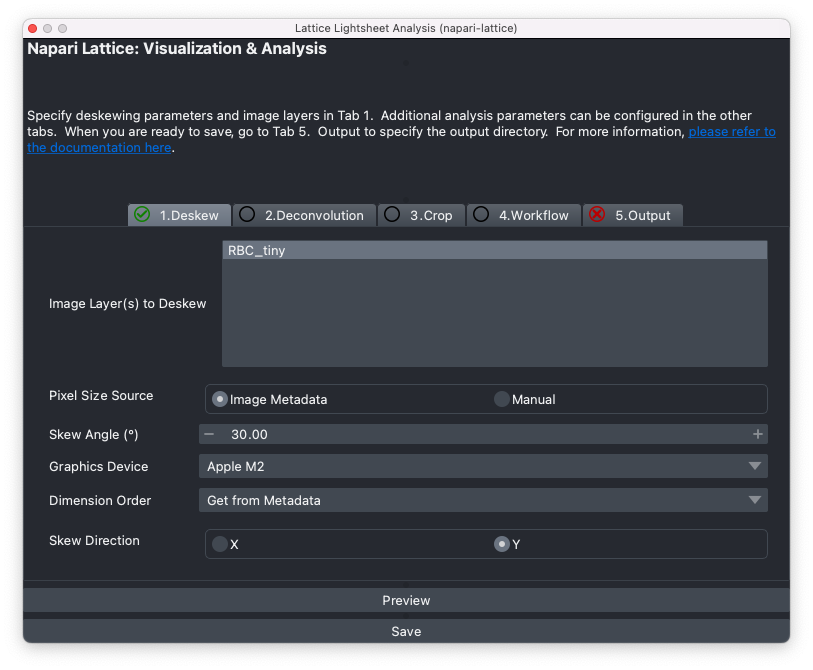

# napari-lattice

**napari-lattice** is a toolset for deskewing, deconvolving, cropping, visualising and
building custom analysis pipelines for light-sheet microscopy data — with a particular
focus on the **Zeiss Lattice Lightsheet 7 (LLS7)**.

It works both as a [napari](https://napari.org) plugin (GUI) and as a command line
interface (`lls-pipeline`, powered by `lls-core`), so you can process data interactively
on the desktop or headless on an HPC at scale. The processing pipeline is **modular and
parameter-driven** — every step (deskew, deconvolution, cropping, workflows, output) is
configurable, which is what lets napari-lattice adapt to different acquisition geometries.

!!! tip "Beyond the Zeiss LLS7"

    Because the deskew is parameter-driven — you set the skew direction (X or Y), skew
    angle, and whether to apply the coverslip rotation — napari-lattice generalises beyond
    the Zeiss LLS7. The same pipeline deskews **oblique plane microscopy (OPM)** data from
    non-Zeiss systems in different configurations. See
    [`--no-coverslip-rotation`](cli.md#coverslip-frame-deskew-no-coverslip-rotation) for
    the OPM/SOPi (shear-only) deskew mode.

## What it can do

- Deskew and deconvolve lattice lightsheet data, with a focus on the Zeiss LLS7
- Handle other skewed-acquisition geometries, including oblique plane microscopy (OPM), via configurable skew direction, skew angle and coverslip rotation
- Flip the scan direction (`Invert Scan Direction`) for microscopes whose stage/galvo scans run opposite to the Zeiss LLS
- Generate a deskewed **maximum-intensity projection (MIP) on the fly**, computed straight from the raw data without ever building the full deskewed volume — fast and memory-light for terabyte-scale acquisitions
- Preview a deskewed image at a channel or timepoint of interest, without processing the whole volume
- Crop and process only a small region of interest, including ROIs imported from Fiji's ROI Manager
- Build custom image-processing pipelines with [`napari-workflows`](https://github.com/haesleinhuepf/napari-workflows)
- Run deskewing, deconvolution and workflows from the terminal for batch/HPC processing
- Save output as OME-Zarr, HDF5 (BigDataViewer/BigStitcher) or TIFF

## Get started

-   :octicons-download-24:{ .lg .middle } __Installation__

    ---

    Install napari-lattice (GUI) or just the `lls-core` command line interface.

    [:octicons-arrow-right-24: Install](installation.md)

-   :octicons-play-24:{ .lg .middle } __Napari Plugin__

    ---

    Open the plugin, load your data, and deskew, deconvolve and crop from the GUI.

    [:octicons-arrow-right-24: Use the plugin](napari_plugin/index.md)

-   :octicons-terminal-24:{ .lg .middle } __Command Line__

    ---

    Run `lls-pipeline` for headless, scriptable and HPC batch processing.

    [:octicons-arrow-right-24: CLI reference](cli.md)

-   :octicons-code-24:{ .lg .middle } __Python API__

    ---

    Drive the processing pipeline directly from Python with `LatticeData`.

    [:octicons-arrow-right-24: Python usage](api.md)

-   :octicons-workflow-24:{ .lg .middle } __Workflows__

    ---

    Chain custom analysis steps onto the deskewed image with `napari-workflows`.

    [:octicons-arrow-right-24: Build a workflow](workflows/index.md)

-   :octicons-book-24:{ .lg .middle } __Supporting Resources__

    ---

    Preparing ROIs for cropping and other helpful references.

    [:octicons-arrow-right-24: Resources](miscellaneous/index.md)

## Sample data

Sample lattice lightsheet data is available on Zenodo:
<https://doi.org/10.5281/zenodo.7117784>

## Citing

If you use napari-lattice in your work, please cite:

> Rajasekhar, P., Milton, M., Geoghegan, N., Haase, R., Rogers, K. L., & Whitehead, L. (2025).
> napari-lattice (v1.0.3). Zenodo. <https://doi.org/10.5281/zenodo.14776381>

## Acknowledgment

This project was supported by funding from the
[Rogers Lab at the Centre for Dynamic Imaging at the Walter and Eliza Hall Institute of Medical Research](https://imaging.wehi.edu.au/),
and made possible in part by a
[napari plugin accelerator grant](https://chanzuckerberg.com/science/programs-resources/imaging/napari/lattice-light-sheet-data-analysis-toolset/)
from the Chan Zuckerberg Initiative DAF, an advised fund of the Silicon Valley Community Foundation.
