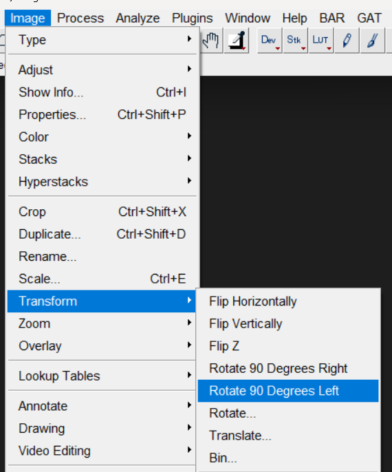
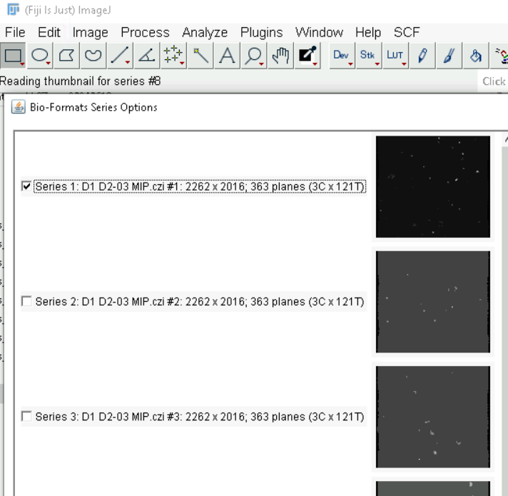
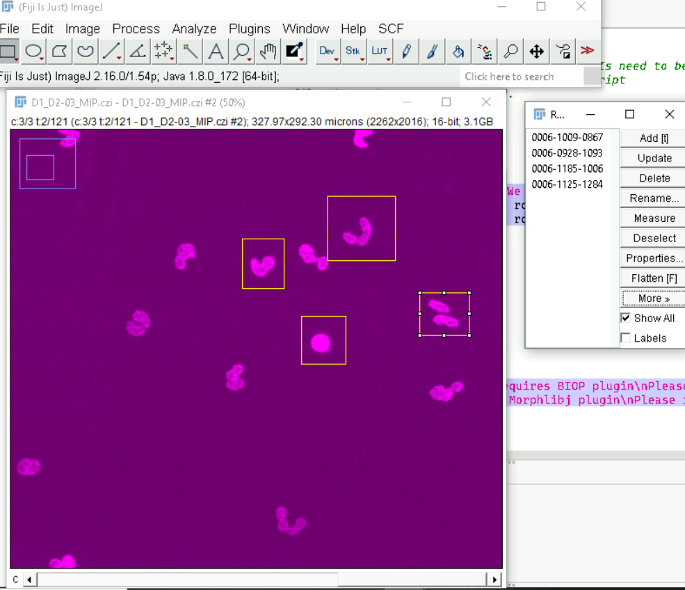
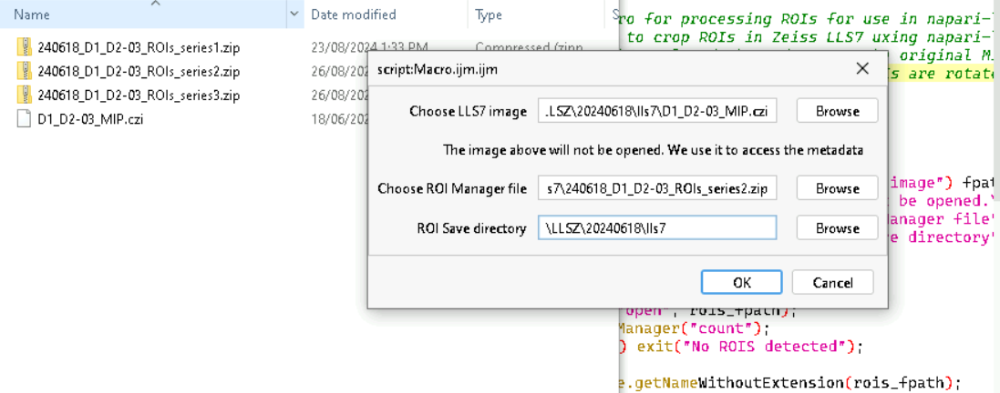
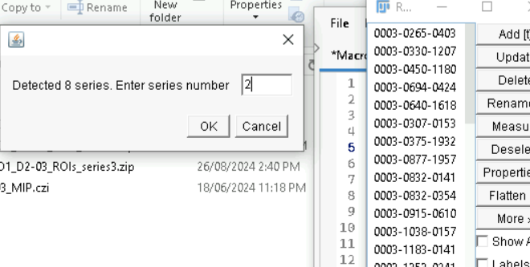

## Zeiss Lattice Lightsheet 7 

When using the Zeiss LLS7, at the end of every acquisition a maximum intensity projection (MIP) image is created. This can be used for defining the ROIs for cropping. However, the ROIs need to be rotated by 90 degrees before it can be used in napari-lattice. 

!!! tip "No LLS7 MIP? Generate one yourself"

    You are not limited to the Zeiss-generated MIP. You can produce a deskewed MIP from any supported dataset with `lls-pipeline --save-mip` and draw ROIs on that. See the [MIP walkthrough](../examples/mips.md) for the end-to-end procedure.

There are two ways around this in Fiji:
- Rotate the image and then define ROI
- If ROIs have already been defined, rotate the ROIs using a Fiji macro

### 1. Rotate image and then define ROI

Alternatively, you can rotate the image, draw ROIs and save the ROI Manager file.

- Open the MIP image in Fiji
- Go to Image -> Transform -> Rotate 90 degrees left

    { width="300" }

- Wait for the Image to be rotated.
- Once that is finished, draw ROIs using the rectangle tool. 
- Add each ROI to the ROI Manager.
- Save the ROI Manager as a zip file. 
- This ROI file can now be imported into napari-lattice workflows.

### 2. Rotate ROIs in Fiji

- Open the LLS7 MIP in Fiji. If you have multiple wells, they will appear as different series.

 { width="300" }

- Draw ROIs on the MIP

 { width="300" }

- Save the ROIs in a folder
- Download this [Fiji macro](../files/zeiss_lls7_MIP_rotate_roi.ijm). You will need plugins: [BIOP](https://wiki-biop.epfl.ch/en/ipa/fiji/update-site) and [MorpholibJ](https://ijpb.github.io/MorphoLibJ/).
- To run this, drag and drop onto Fiji. Once it opens, you can either click `F5` or `Run -> Run` in the menu on the macro window.
- You will get the following window.

{ width="500" }

    * `Choose LLS7 image`: Enter path to the image
    * `Choose ROI Manager file`: ROI Manager file created above with areas to crop
    * `ROI Save directory`: Location to save the modified ROIs
- If the MIP has multiple series, then you will get the prompt below.

{ width="300" }

- Specify the series number to process. **Note that you should specify the ROI file for the corresponding series when running this macro.**
- This will process the ROI Manager file and save it in the specified directory with `_corrected` suffix.
- This ROI file can be used in the napari-lattice workflows.

## Saving ROIs from napari

ROIs drawn in the plugin can be saved and reloaded later, so a set of crops does not have
to be redrawn each session.

- Select the `Napari Lattice Crop` layer in the layer list.
- Go to `File -> Save Selected Layers` and save it as a `.csv`.

That file can be given back to `Import ROI` in the plugin, or to `--roi-list` on the
command line. Both accept Fiji `.roi`/`.zip` and napari `.csv`.

!!! note "Pixels or microns?"

    An ROI file does not record its units. Fiji writes **pixels**; a napari shapes layer
    saved from the plugin's crop layer is in **microns**, because that layer is unscaled
    while the image layer carries the pixel size. Both the plugin and the CLI default to
    `Auto`, which picks the right one from the file extension, so ordinarily there is
    nothing to set. Override it (`units` in the plugin, `--roi-units` on the command line)
    only for a `.csv` produced by something other than napari.

## Processing a subset of ROIs

A ROI file may contain many regions. By default all of them are processed. To
process only some of them, or to speed up processing of many ROIs in parallel,
see [ROI selection and Parallel ROI Processing](../api.md#selecting-which-rois-to-process).

