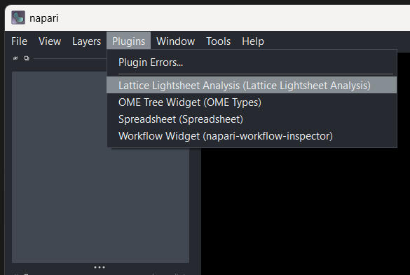
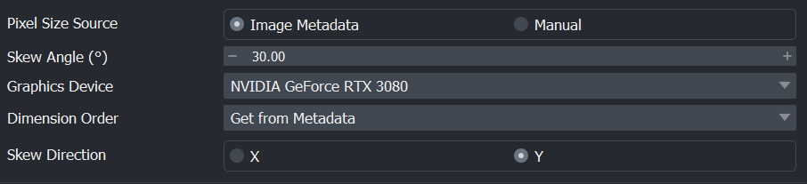

# Napari Plugin

## Starting the plugin

The napari plugin has been redesigned in the newer version.
To activate the plugin, activate the `napari-lattice` environment in your terminal and type `napari` in the console.
The plugin is under `Lattice Lightsheet Analysis`

{ width="600" }

The plugin should appear on the right side. You may have to resize the window.

{ width="600" }

The functionalities with napari-lattice have been separated out into tabs:

{ width="600" }

If its configured correctly, you should see a green tick next to the tab name, else you will see a red cross.

To load an image, drag and drop it into napari. You can get some sample data [here](https://zenodo.org/records/7117784). We are using `RBC_tiny.czi` as an example here.

{ width="600" }

## Configuration

To configure any parameters, you can change the settings here:

## Deskewing

To use the specific image for processing, you will have to select it under the `Image Layer(s) to Deskew` box on the right. Here, we will click on `RBC_tiny`. As its a czi file it should read the `metadata` accordingly and you will see a green tick.

If you are loading a czi, the metadata fields should be populated automatically.

To `Preview` the deskewed image, click `Preview` and choose the appropriate `channel` and `time`.

You should see the deskewed image appear as an extra layer with the `Preview` suffix attached to it.

{ width="600" }

??? Extra_info
    If you look at the terminal after deskew, you should see the settings used and any other metadata associated with the dataset. It is handy for troubleshooting.

More instructions to be added...

## Deconvolution

## Cropping

## Workflow

## Output (Saving files)

