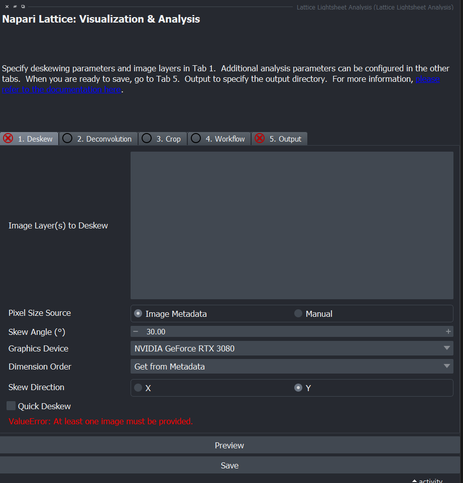
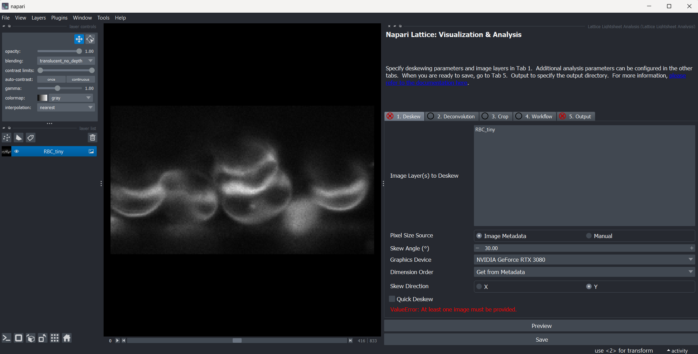
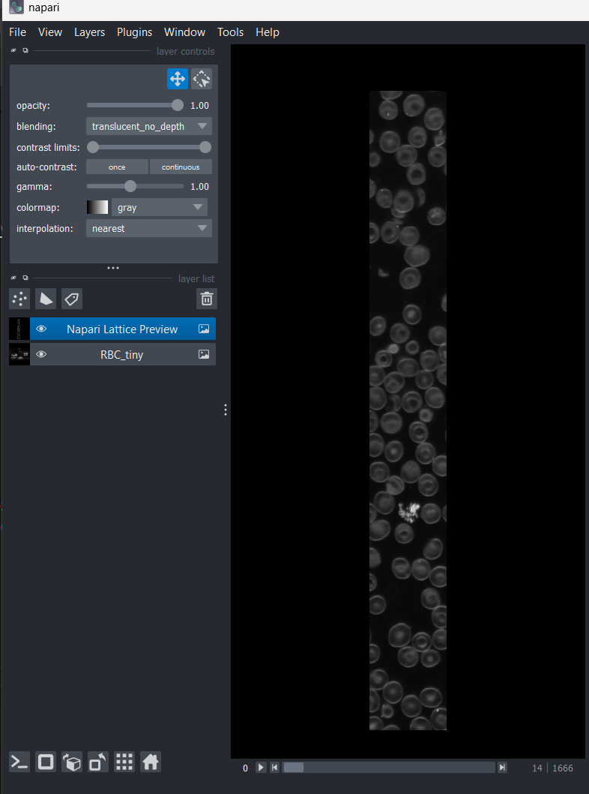

# Napari Plugin

## Starting the plugin

The napari plugin has been redesigned in the newer version.
To activate the plugin, activate the `napari-lattice` environment in your terminal and type `napari` in the console.
The plugin is under `Lattice Lightsheet Analysis`

{ width="600" }

The plugin should appear on the right side. You may have to resize the window.

{ width="600" }

The functionalities with napari-lattice have been separated out into tabs:

{ width="600" }

If its configured correctly, you should see a green tick next to the tab name, else you will see a red cross.

To load an image, drag and drop it into napari. You can get some sample data [here](https://zenodo.org/records/7117784). We are using `RBC_tiny.czi` as an example here.

{ width="600" }

!!! info

    When opening a file, if you get a pop-up asking for preferred reader with `czi` files, select napari-aicsimageio

## Configuration

To configure any parameters, you can change the settings here:

## Deskewing

To use the specific image for processing, you will have to select it under the `Image Layer(s) to Deskew` box on the right. Here, we will click on `RBC_tiny`. As its a czi file it should read the `metadata` accordingly and you will see a green tick.

If you are loading a czi, the metadata fields should be populated automatically.

To `Preview` the deskewed image, click `Preview` and choose the appropriate `channel` and `time`.

You should see the deskewed image appear as an extra layer with the `Preview` suffix attached to it.

{ width="600" }

??? Extra_info
    If you look at the terminal after deskew, you should see the settings used and any other metadata associated with the dataset. It is handy for troubleshooting.

## Quick Deskew

From version 1.0.3 onwards, we have an option to show the Deskewed image without actually deskewing it. 
It does not create a new image, but simply transforms the image in the canvas to a deskewed image. 
This can be useful for quick preview of the data.

To do this, once the plugin is initialized, click on `Quick Deskew`.

Once you click it, you can view the deskewed image in the napari image canvas.

You may get the following warning: `Non-orthogonal slicing is being requested, but is not fully supported. Data is displayed without applying an out-of-slice rotation or shear component.!`
This is absolutely fine. It just means the image won't be displayed as deskewed in 2D mode. Hence, why we enable 3D mode.

Here is an example of browsing through a timeseries

The smoothness of this interactivity will depend on the storage read/write speeds and/or network speeds. For example, if the data is stored on the network, it will be slow to browse timepoints. However, if your data is on your SSD locally, the experience will be much better.

More instructions to be added...

## Deconvolution

## Cropping

## Workflow

## Output (Saving files)

