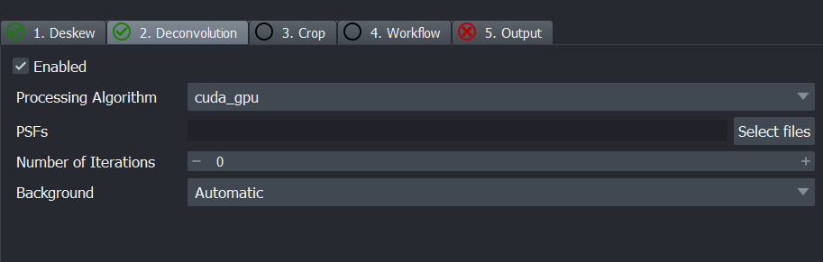
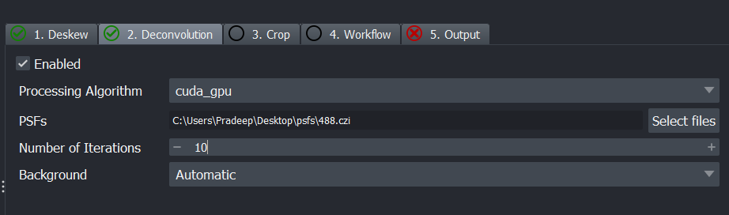
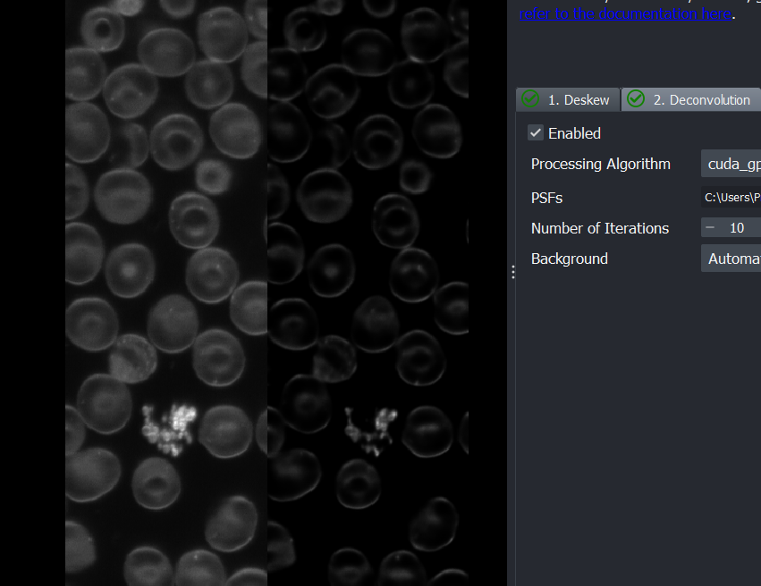
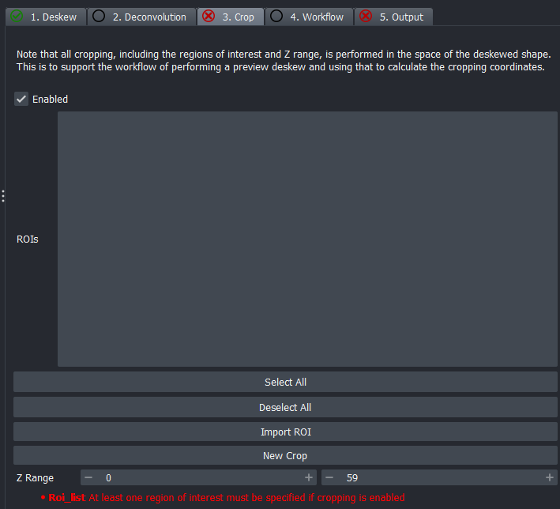
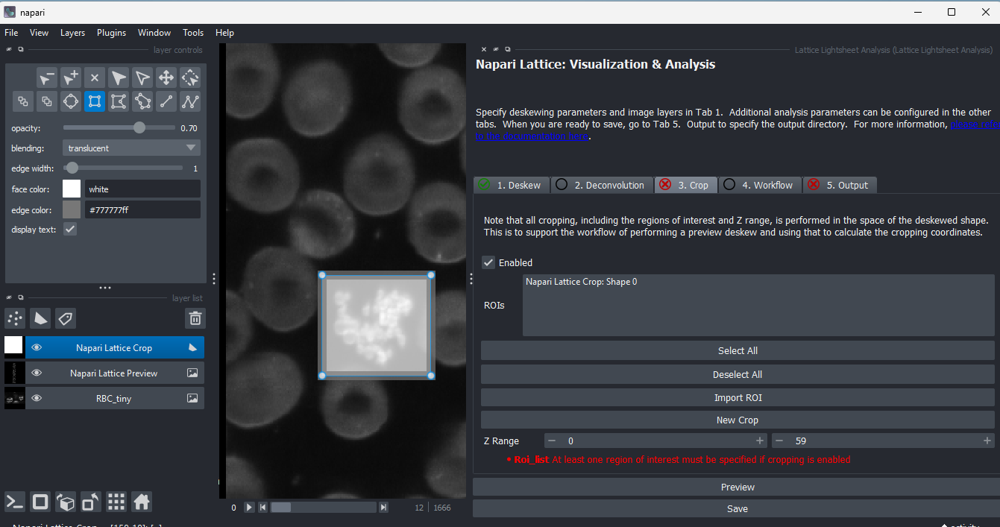
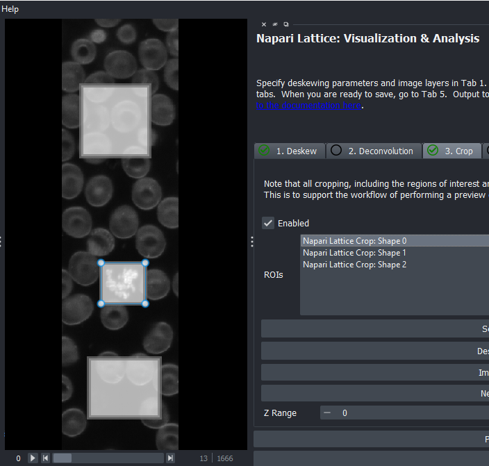
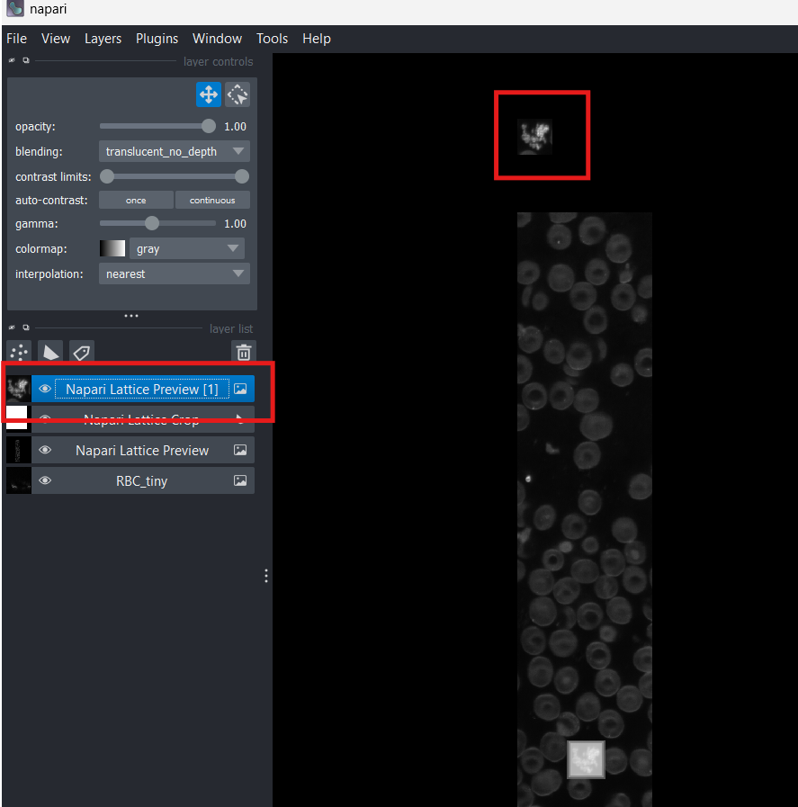

## Plugin Usage

Click on the tabs below to view the corresponding functionality.

=== "Deskewing"

    To use the specific image for processing, you will have to select it under the `Image Layer(s) to Deskew` box on the right. Here, we will click on `RBC_tiny`. As its a czi file it should read the `metadata` accordingly and you will see a green tick.

    

    If you are loading a czi, the metadata fields should be populated automatically.

    To `Preview` the deskewed image, click `Preview` and choose the appropriate `channel` and `time`.

    You should see the deskewed image appear as an extra layer with the `Preview` suffix attached to it.

    { width="600" }

    ??? Extra_info
        If you look at the terminal after deskew, you should see the settings used and any other metadata associated with the dataset. It is handy for troubleshooting.

=== "Quick Deskew"
    
    From version 1.0.3 onwards, we have an option to show the Deskewed image without actually deskewing it. 
    It does not create a new image, but simply transforms the image in the canvas to a deskewed image. 
    This can be useful for quick preview of the data.

    To do this, once the plugin is initialized, click on `Quick Deskew`.

    

    Once you click it, you can view the deskewed image in the napari image canvas.

    

    You may get the following warning: `Non-orthogonal slicing is being requested, but is not fully supported. Data is displayed without applying an out-of-slice rotation or shear component.!`
    This is absolutely fine. It just means the image won't be displayed as deskewed in 2D mode. Hence, why we enable 3D mode.

    Here is an example of browsing through a timeseries

    

    The smoothness of this interactivity will depend on the storage read/write speeds and/or network speeds. For example, if the data is stored on the network, it will be slow to browse timepoints. However, if your data is on your SSD locally, the experience will be much better.

=== "Deconvolution"

    Deconvolution is primarily enabled by `pycudadecon`. For this functionality, you will need the point spread function (PSF) for the corresponding channel, either simulated or experimentally derived. You can find examples [here](https://doi.org/10.5281/zenodo.7117783).

    !!! Important

        Ensure you are using the right PSF file for each channel. The number and order of the PSF files should match the channels in the image.

    After loading the image and configuring it in the `Deskew` tab, select the `Deconvolution` tab. When you click `Enable`, you should see a green tick appear next to the name.

    

    Under processing algorithms only `cuda_gpu` and `cpu` are supported. `opencl_gpu` has not been implemented yet.
    The next step is to select the PSF files. In this example, we will use the `RBC_tiny.czi` file

    

    - **PSFs**: Use the `Select files` to select multiple PSF files. As the dataset was acquired in the 48 channel, we use the 488.czi PSF file here.
    - **Number of iterations**: Try 10 if not sure and increase if needed.
    - **Background**: Background to subtract. 
        - **Automatic**: median value of last Z slice will be used
        - **Second Last**: median value of second last Z slice will be used. This is used in case the last Z slice is incomplete if acquisition is prematurely stopped.
        - **Custom**: Enter a custom value

    Once you are done, click `Preview` at the bottom, and select timepoint or channel. You should see output from `pycudadecon` printed to the terminal. 
    When complete, a deconvolved image will appear as an extra image layer. Below is an example of the deskewed image without (left) and with (right) deconvolution.

    

=== "Cropping"

    There are two ways to do the cropping:

    * Define ROIs within napari-lattice plugin
    * Import ROIs generated elsewhere, such as Fiji ROI Manager.

    <u>**Define ROIs in napari-lattice**</u>
    
    - Load and configure the image in the `Deskew` tab and you should see a green tick. 
    - Run Preview to get a deskewed volume. We will use this as a reference to draw ROIs for cropping.
    - Go to the `Crop` tab and tick the `Enabled` button to activate cropping.

    { width="400" }

    The red text at the bottom indicates that atleast one ROI must be specified.

    - Click on `New Crop` at the bottom of the plugin to add a `Shapes` layer on the left to draw ROIs. This Shapes layer will be called `Napari Lattice Crop`. Click here for more info on using [Shapes layers and drawing shapes](https://napari.org/dev/howtos/layers/shapes.html).
    - Click on the `Napari Lattice Crop` Shapes layer and the rectangular ROI tool will be selected by default. 
    - Draw an ROI around the region you would like to crop. After defining the ROI, it will appear on the right.
    
    - Similarly, you can draw multiple ROIs. Each ROI will be an entry in the ROIs box. When you select one of them, the error message below will disappear.

    {width="450"}

    - Once you have drawn the ROIs, select one of them, and click `Preview` to visualize the cropped region. The cropped image will appear as a new layer in the image layer list on the left. 

    

    - The purpose of the Crop tab is to setup the ROIs. Once you've defined all of them, you can save all of them by configuring it in the `Output` tab.

    <u>**Import ROIs**</u>

    We have added support to import ROIs from Fiji ROI Manager file. This workflow exists because the Zeiss lattice lightsheet produces a 2D maximum intensity projection at the end of the acquisition. This image can be used to select ROIs of interest in Fiji. Refer to this page [for more instructons on how to generate](../miscellaneous/index.md).

    MORE INSTRUCTIONS TO BE ADDED

=== "Workflow"
    
    Instructions about importing workflows to be added

=== "Output (Saving files)"
    
    Instructions on how to save files after setting up the other tabs

