## Plugin Usage

Click on the tabs below to view the corresponding functionality.

=== "Deskewing"

    To use the specific image for processing, you will have to select it under the `Image Layer(s) to Deskew` box on the right. Here, we will click on `RBC_tiny`. As its a czi file it should read the `metadata` accordingly and you will see a green tick.

    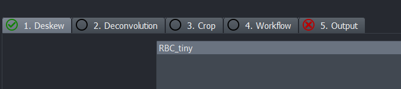

    If you are loading a czi, the metadata fields should be populated automatically.

    To `Preview` the deskewed image, click `Preview` and choose the appropriate `channel` and `time`.

    You should see the deskewed image appear as an extra layer with the `Preview` suffix attached to it.

    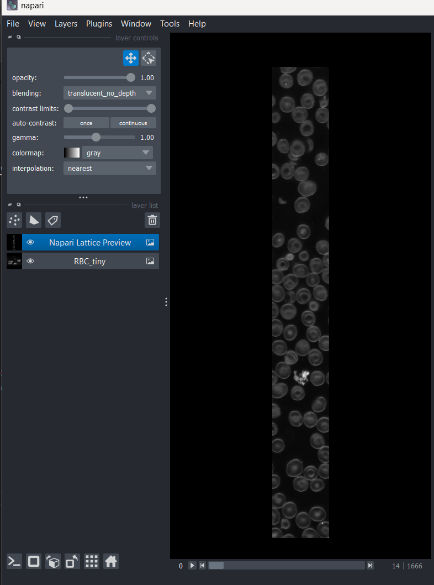{ width="600" }

    ??? Extra_info
        If you look at the terminal after deskew, you should see the settings used and any other metadata associated with the dataset. It is handy for troubleshooting.

    **The deskew options**

    The `Deskew` tab collects every parameter needed to interpret and deskew the raw data. For a Zeiss LLS7 `.czi`, the metadata fills most of these in for you; for other microscopes you set them to match your acquisition geometry.

    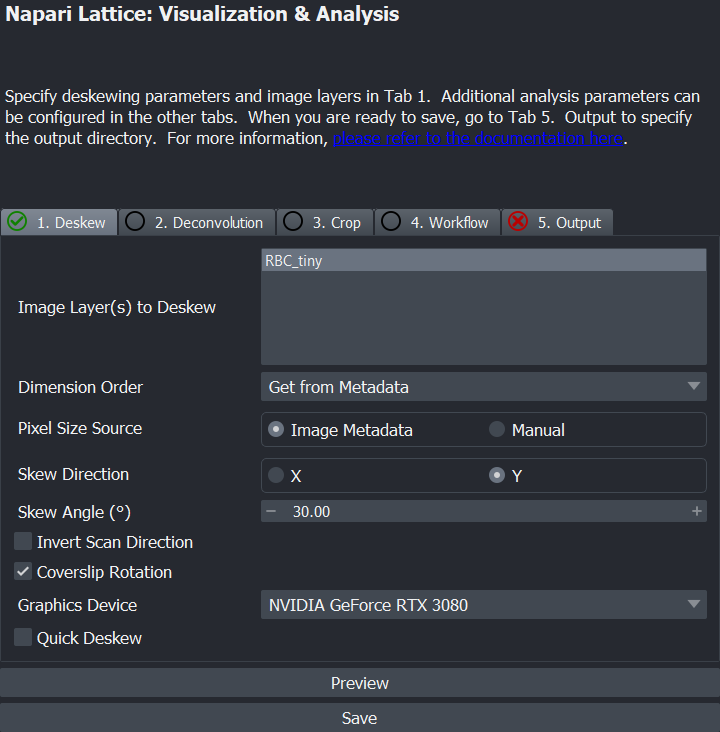{ width="500" }

    | Option | What it does | How to set it |
    |--------|--------------|---------------|
    | **Image Layer(s) to Deskew** | The napari layer(s) to process. | Select your image. Selecting more than one stacks them together. |
    | **Stack Along** | The axis multiple selected layers are stacked along. | Only relevant when you select several layers (e.g. per-channel layers) — choose `Channel` or `Time`. |
    | **Dimension Order** | How the raw array's axes map to Z/C/T/Y/X. | `Get from Metadata` for a czi; otherwise set it explicitly (e.g. `CZYX`). |
    | **Pixel Size Source** | Whether pixel sizes come from the file or are entered by hand. | `Image Metadata` for a czi; `Manual` for formats without metadata (then fill **Pixel Sizes: XYZ (µm)**). |
    | **Skew Direction** (`X` / `Y`) | The axis the acquisition is skewed along. | `Y` for the Zeiss LLS7 (default). OPM/SOPi systems may be `X` or `Y` — match your scan axis. |
    | **Skew Angle (°)** | The light-sheet angle. | `30°` for the Zeiss LLS7. Set to your system's angle (e.g. **45°** for the OPM datasets in the manuscript). |
    | **Invert Scan Direction** | Reverses the plane order along the scan (Z) axis before deskewing. | Leave **off** for the Zeiss LLS. Tick it if your stage/galvo scans in the *opposite* direction (common on OPM), which would otherwise mirror the reconstruction. |
    | **Coverslip Rotation** | Whether to rotate the deskewed volume by the skew angle (standard deskew). | **On** for the Zeiss LLS7 (coverslip-level output). **Off** for OPM/SOPi to deskew into the shear-only, coverslip-level frame. |
    | **Graphics Device** | The GPU used for processing. | Pick your GPU (a CPU OpenCL device also works, but slower). |
    | **Quick Deskew** | Live in-canvas preview of the deskew without processing. | See the **Quick Deskew** tab. |

    !!! tip "Choosing settings by geometry"

        - **Zeiss LLS7** — `Skew Direction = Y`, `Skew Angle = 30`, `Coverslip Rotation = on`, `Invert Scan Direction = off`. A czi populates these automatically.
        - **Oblique plane / SOPi (OPM)** — typically a different `Skew Angle` (e.g. 45°), manually entered voxel sizes, `Coverslip Rotation = off`, and often `Invert Scan Direction = on` (opposite scan direction). See [`--no-coverslip-rotation`](../cli.md#coverslip-frame-deskew-no-coverslip-rotation).

=== "Quick Deskew"
    
    From version 1.0.3 onwards, we have an option to show the Deskewed image without actually deskewing it. 
    It does not create a new image, but simply transforms the image in the canvas to a deskewed image. 
    This can be useful for quick preview of the data and especially if you have a large dataset that you don't want to process yet.

    Load and select your image in the `Deskew` tab, switch napari to **3D view** (the cube icon, bottom-left), then tick `Quick Deskew` at the bottom of the `Deskew` tab.

    Before enabling it, the raw volume is shown skewed — tilted at the light-sheet angle:

    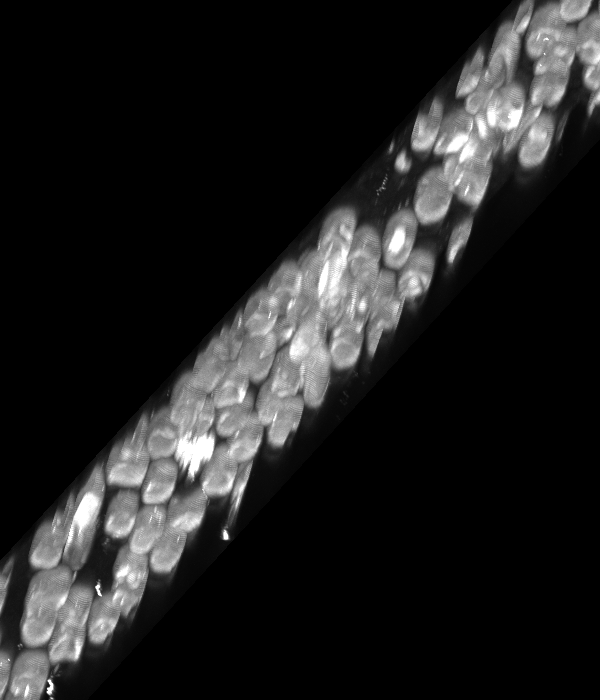{ width="400" }

    With `Quick Deskew` ticked, the same layer is transformed in-canvas to its deskewed shape, without generating a new image:

    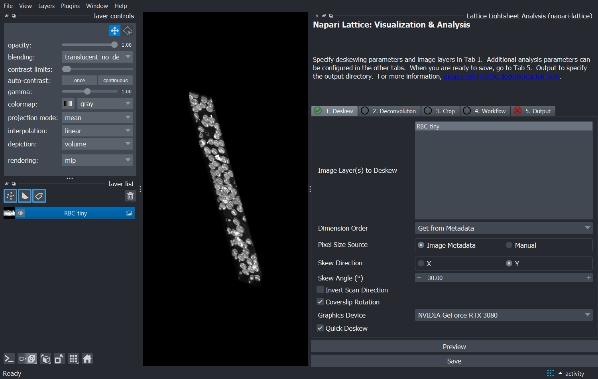{ width="400" }

    You may get the following warning: `Non-orthogonal slicing is being requested, but is not fully supported. Data is displayed without applying an out-of-slice rotation or shear component.!`
    This is absolutely fine. It just means the image won't be displayed as deskewed in 2D mode. Hence, why we enable 3D mode.

    Here is an example of browsing through a timeseries

    

    The smoothness of this interactivity will depend on the storage read/write speeds and/or network speeds. For example, if the data is stored on the network, it will be slow to browse timepoints. However, if your data is on your SSD locally, the experience will be much better.

=== "Deconvolution"

    Deconvolution is primarily enabled by `pycudadecon`. For this functionality, you will need the point spread function (PSF) for the corresponding channel, either simulated or experimentally derived. You can find examples [here](https://doi.org/10.5281/zenodo.7117783).

    !!! Important

        Ensure you are using the right PSF file for each channel. The number and order of the PSF files should match the channels in the image.

    After loading the image and configuring it in the `Deskew` tab, select the `Deconvolution` tab. When you click `Enable`, you should see a green tick appear next to the name.

    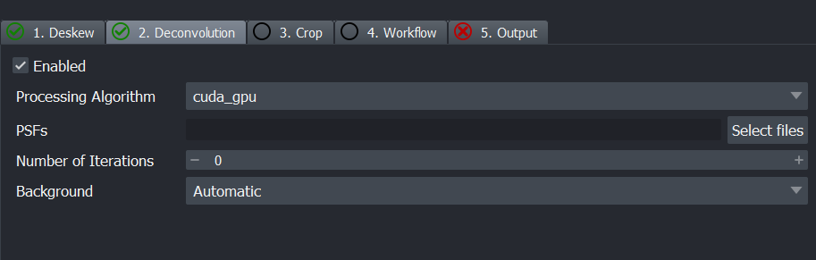

    Under processing algorithms only `cuda_gpu` and `cpu` are supported. `opencl_gpu` has not been implemented yet.
    The next step is to select the PSF files. In this example, we will use the `RBC_tiny.czi` file

    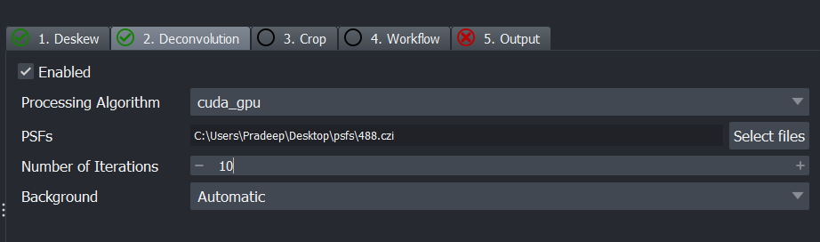

    - **PSFs**: Use the `Select files` to select multiple PSF files. As the dataset was acquired in the 488 nm channel, we use the 488.czi PSF file here.
    - **Number of iterations**: Try 10 if not sure and increase if needed.
    - **Background**: Background to subtract. 
        - **Automatic**: median value of last Z slice will be used
        - **Second Last**: median value of second last Z slice will be used. This is used in case the last Z slice is incomplete if acquisition is prematurely stopped.
        - **Custom**: Enter a custom value

    Once you are done, click `Preview` at the bottom, and select timepoint or channel. You should see output from `pycudadecon` printed to the terminal. 
    When complete, a deconvolved image will appear as an extra image layer. Below is an example of the deskewed image without (left) and with (right) deconvolution.

    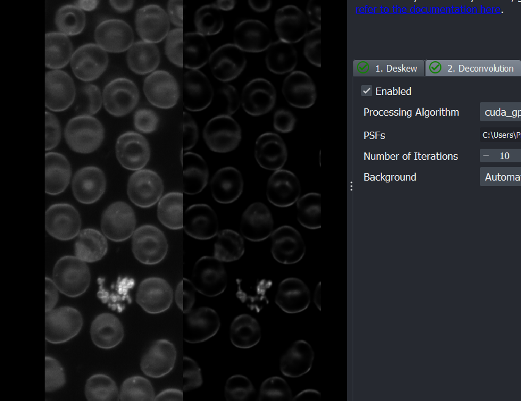

=== "Cropping"

    There are two ways to do the cropping:

    * Define ROIs within napari-lattice plugin
    * Import ROIs generated elsewhere, such as Fiji ROI Manager.

    <u>**Define ROIs in napari-lattice**</u>
    
    - Load and configure the image in the `Deskew` tab and you should see a green tick. 
    - Run Preview to get a deskewed volume. We will use this as a reference to draw ROIs for cropping.
    - Go to the `Crop` tab and tick the `Enabled` button to activate cropping.

    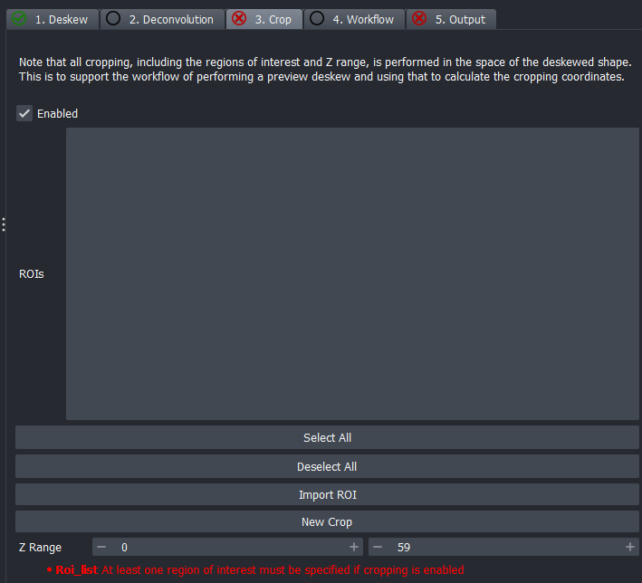{ width="400" }

    The red text at the bottom indicates that atleast one ROI must be specified.

    - Click on `New Crop` at the bottom of the plugin to add a `Shapes` layer on the left to draw ROIs. This Shapes layer will be called `Napari Lattice Crop`. Click here for more info on using [Shapes layers and drawing shapes](https://napari.org/dev/howtos/layers/shapes.html).
    - Click on the `Napari Lattice Crop` Shapes layer and the rectangular ROI tool will be selected by default. 
    - Draw an ROI around the region you would like to crop. After defining the ROI, it will appear on the right.
    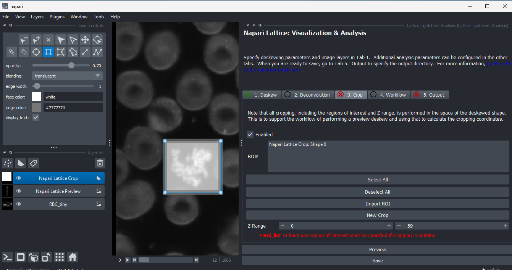
    - Similarly, you can draw multiple ROIs. Each ROI will be an entry in the ROIs box. When you select one of them, the error message below will disappear.

    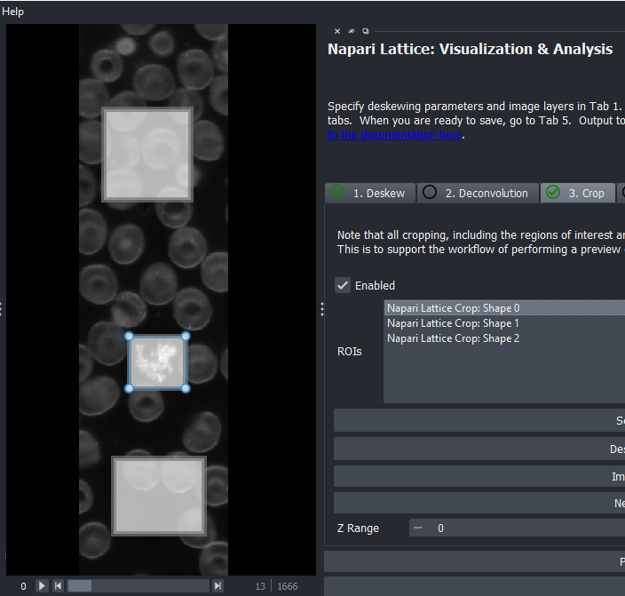{width="450"}

    - Once you have drawn the ROIs, select one of them, and click `Preview` to visualize the cropped region. The cropped image will appear as a new layer in the image layer list on the left. 

    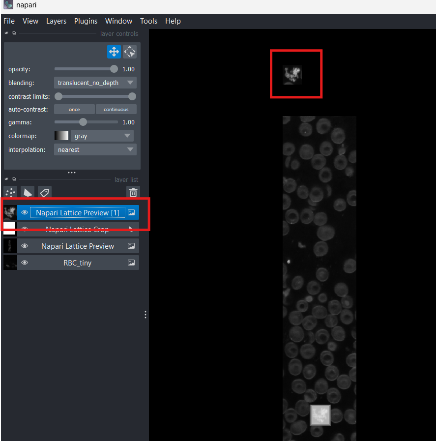

    - The purpose of the Crop tab is to setup the ROIs. Once you've defined all of them, you can save all of them by configuring it in the `Output` tab.

    <u>**Import ROIs**</u>

    We have added support to import ROIs from a Fiji ROI Manager file. This workflow exists because the Zeiss lattice lightsheet produces a 2D maximum intensity projection at the end of the acquisition. This image can be used to select ROIs of interest in Fiji. Refer to this page [for instructions on how to generate and rotate these ROIs](../miscellaneous/rois_cropping.md).

    Once you have a Fiji ROI Manager file (a `.zip`, or a single `.roi`):

    - Configure your image in the `Deskew` tab (green tick) and go to the `Crop` tab with `Enabled` ticked.
    - Click `Import ROI` at the bottom of the plugin and select your ROI file.
    - The imported regions are added to the canvas as a new `Shapes` layer with yellow outlines. They are converted into the deskewed image space automatically.
    - Select an ROI and click `Preview` to check the cropped region, exactly as with ROIs drawn by hand.

    !!! info

        ROIs are always interpreted in the space of the **deskewed** image, so make sure the ROIs were defined against the LLS7 MIP (and rotated as described in [Supporting Resources](../miscellaneous/rois_cropping.md)) before importing.

=== "Workflow"

    The `Workflow` tab lets you attach a custom [`napari-workflows`](https://github.com/haesleinhuepf/napari-workflows) analysis pipeline that runs on each deskewed (and optionally cropped/deconvolved) 3D volume. For details on building a workflow, see [Workflows](../workflows/index.md).

    - Tick `Enabled` to activate the tab (you should see a green tick).
    - Choose a `Workflow Source`:
        - **Active Workflow**: use the workflow currently loaded in napari (for example, one you built live with [napari-assistant](../workflows/interactive_workflow.md)).
        - **Custom Path**: load a workflow from a saved `.yml` file. A `Workflow Path` field appears — select your file.

    !!! info

        Whichever source you use, the first step of the workflow must take `deskewed_image` as its input. See [Building a Workflow](../workflows/index.md#building-a-workflow) for how this is defined.

    **Example: applying a workflow to `RBC_tiny`**

    The repository ships some ready-made workflows under [`workflow_examples/`](https://github.com/BioimageAnalysisCoreWEHI/napari_lattice/tree/master/workflow_examples). We will use the single-channel `regionprops_workflow`, which smooths the deskewed image, segments it with a Voronoi-Otsu labelling, and measures region properties.

    1. Load and configure `RBC_tiny.czi` in the `Deskew` tab (green tick).
    2. Go to the `Workflow` tab and tick `Enabled`.
    3. Set `Workflow Source` to `Custom Path`.
    4. For `Workflow Path`, select `workflow_examples/regionprops_workflow/regionprops_workflow.yml`. When the workflow loads successfully, the `4. Workflow` tab shows a green tick.

    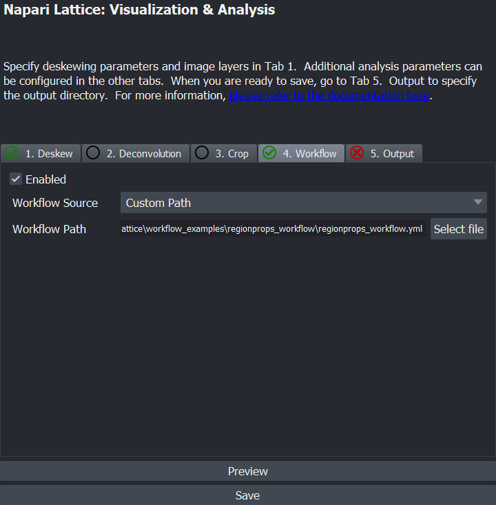{ width="500" }

    !!! info

        The custom functions a workflow uses (here `measure_regionprops.py`) must sit in the **same folder** as the `.yml` file — napari-lattice imports them automatically when the workflow is loaded.

    5. Configure a `Save Directory` in the `Output` tab and click `Save`.

    napari-lattice deskews `RBC_tiny`, runs the workflow on the deskewed volume, and writes the result. This workflow produces a **label image** (the segmented objects) and a **table of measurements** — one row per object, per timepoint and channel:

    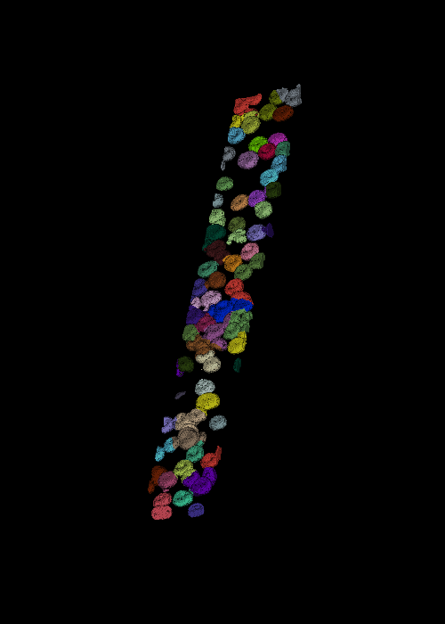{ width="350" }

    ```text
    ,time,channel,area,centroid-0,centroid-1,centroid-2,axis_major_length,axis_minor_length
    0,T0,C0,49351.0,28.52,249.09,12.16,116.25,35.73
    0,T0,C0,36859.0,18.90,353.81,23.41,89.78,25.56
    0,T0,C0,35350.0,20.71,458.17,19.35,63.48,29.04
    ...
    ```

    The label image and measurement table are written to your `Save Directory` when you run the save step from the `Output` tab.

=== "Output (Saving files)"

    The `Output` tab is where you configure and run the final save. The other tabs (`Deskew`, `Deconvolution`, `Crop`, `Workflow`) only set up a *preview*; the `Save` button at the bottom of the plugin processes the full data set using all enabled tabs and writes it to disk.

    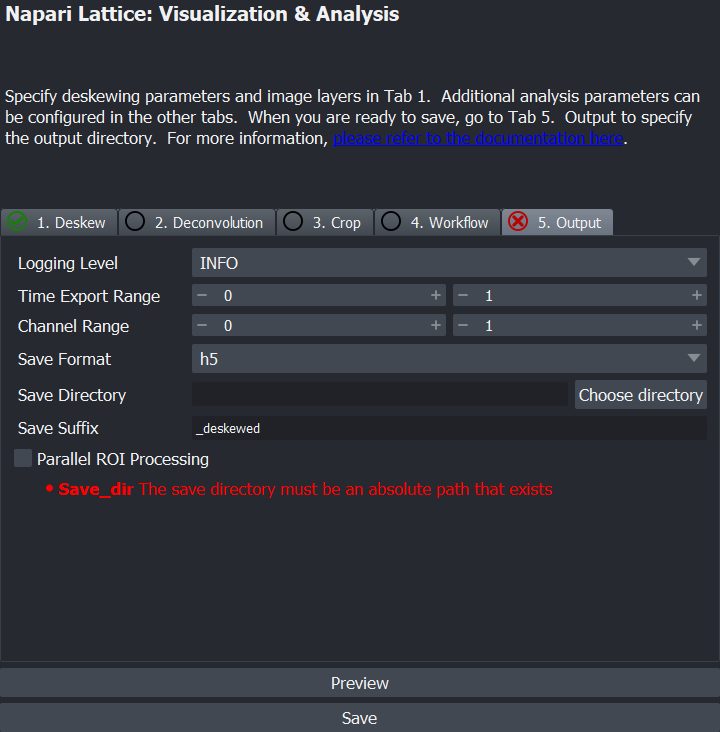{ width="500" }

    - **Logging Level**: verbosity of messages printed to the terminal (`INFO` is a good default; use `DEBUG` for troubleshooting).
    - **Time Export Range** / **Channel Range**: the range of timepoints and channels to process and save. The maximum is set automatically from the loaded image.
    - **Save Format**: the output file type.
        - `tiff` — a compressed OME-TIFF (`.ome.tif`)
        - `h5` — HDF5 for BigDataViewer / BigStitcher
        - `omezarr` — OME-Zarr
    - **Save Directory**: the folder the output files are written to.
    - **Save Suffix**: appended to the output file name.
    - **Parallel ROI Processing**: when cropping with multiple ROIs, process them in parallel worker processes. Leave this off while testing a single ROI. When on, set `Workers` to the number of processes, or `0` to let a memory-safe count be chosen automatically. See [Parallel ROI Processing](../api.md#parallel-roi-processing) for details.

    Once configured, click `Save` to run the pipeline and write the results to the chosen directory.
