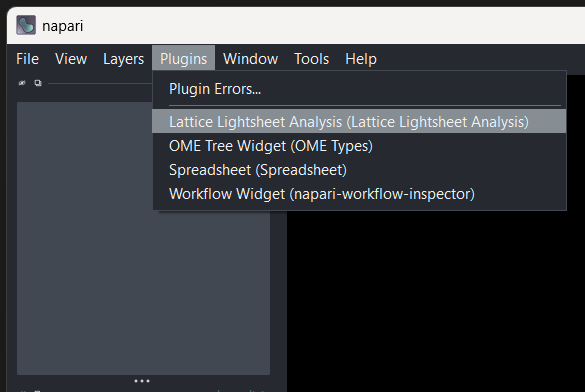
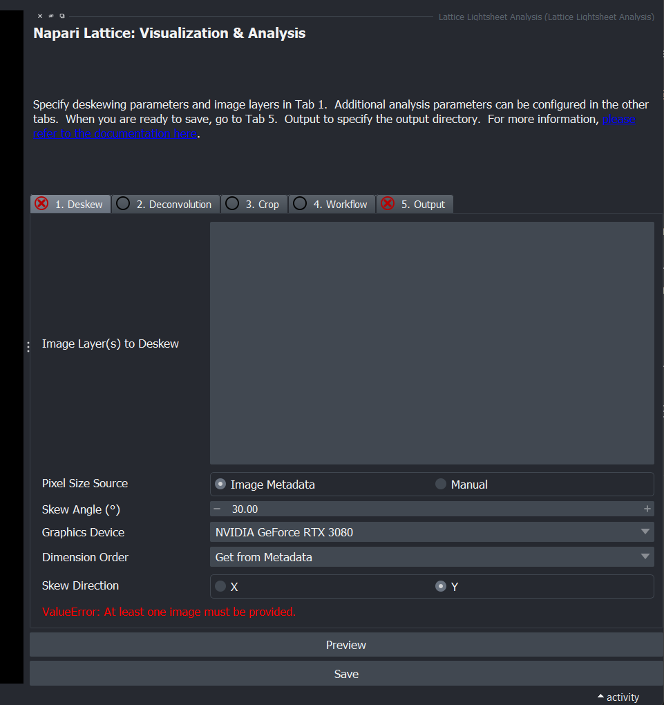
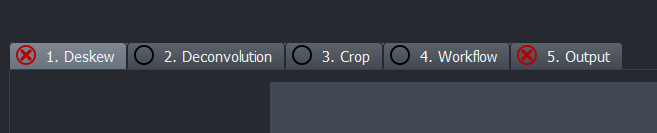
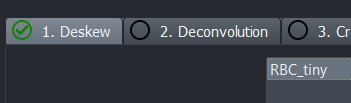
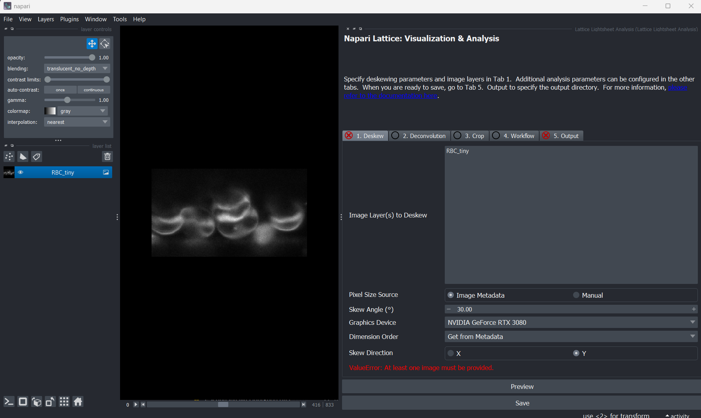
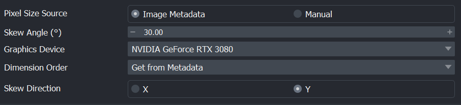

## Starting the plugin

The napari plugin has been redesigned in the newer version.
To activate the plugin, activate the `napari-lattice` environment in your terminal and type `napari` in the console.
The plugin is under `Lattice Lightsheet Analysis`

{ width="600" }

The plugin should appear on the right side. You may have to resize the window.

{ width="600" }

The functionalities with napari-lattice have been separated out into tabs:

{ width="600" }

If its configured correctly, you should see a green tick next to the tab name, else you will see a red cross.

To load an image, drag and drop it into napari. You can get some sample data [here](https://zenodo.org/records/7117784). We are using `RBC_tiny.czi` as an example here.

{ width="600" }

!!! info

    When opening a file, if you get a pop-up asking for preferred reader with `czi` files, select napari-aicsimageio

## Configuration

To configure any parameters, you can change the settings here:

For information on how to use the plugin, click on [`Using the Plugin`](./plugin_usage.md) on the left menu of this page.