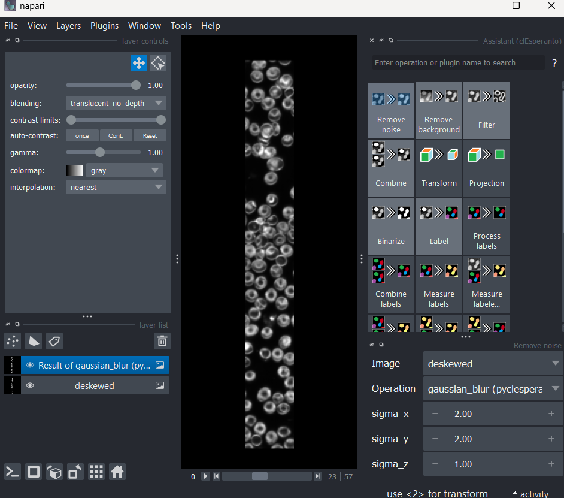
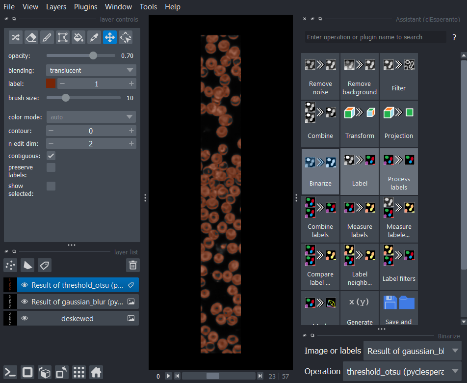
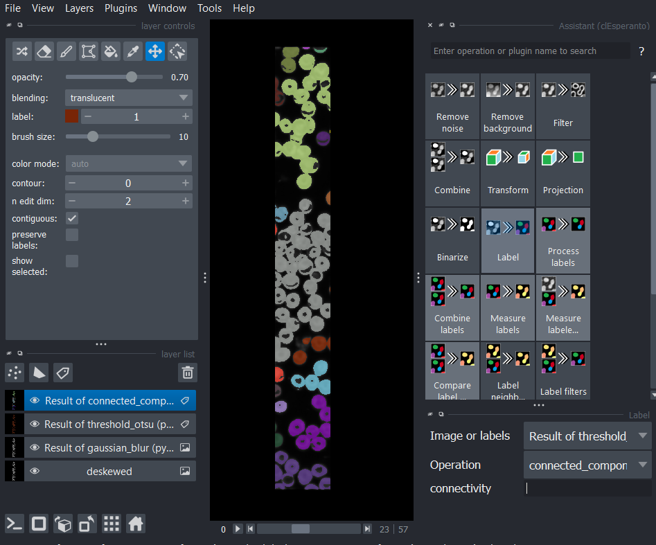
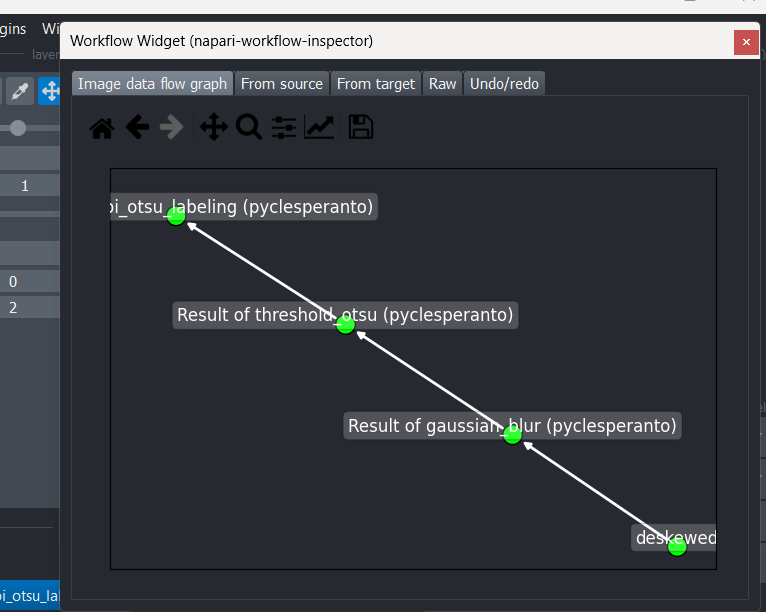

When building your workflow with `napari-assistant`, you are actually building a *template* that will be applied to future images. Ensure you install: [napari-assistant](https://github.com/haesleinhuepf/napari-assistant) and [napari-pyclesperanto-assistant](https://github.com/clEsperanto/napari_pyclesperanto_assistant/) for the steps below.

For example,  we'd like to apply a general image processing workflow:
* Gaussian Blur (Smoothing)
* Otsu Threshold
* Connected Components Labelling

You can test this using a deskewed image or any image really. We recommend setting the image layer name as `deskewed_image` as it will save you from editing the workflow later on. 

Once you have your image layer of interest, go to _Plugins -> Assistant (clesperanto)_. 

Click on `Remove Noise` and a menu will pop-up on the bottom right.

- `Operation`: gaussian blur
- `sigma_x`: 2
- `sigma_y`: 2
- `sigma_z`: 1

Lets apply thresholding

- `Operation`: threshold_otsu

Connected components labelling

- `Operation`: connected_components_labeling

This isn't perfect, but it is an example of a typical analysis workflow. The workflow can be inspected by going to `Plugins -> Workflow Inspector`

When you are finished creating the workflow, it can be saved by clicking the `Save and load workflows` button, followed by `Export to workflow file`, which will save a file with `yml` extension:

Once you've saved the `yml` file, you will need to open it in a notepad or text editor and change the input image, in this case `deskewed` into `deskewed_image`. If your image layer name was already `deskewed_image`, you wouldn't need to do anything. This workflow can now be used in napari-lattice plugin or in the CLI.
